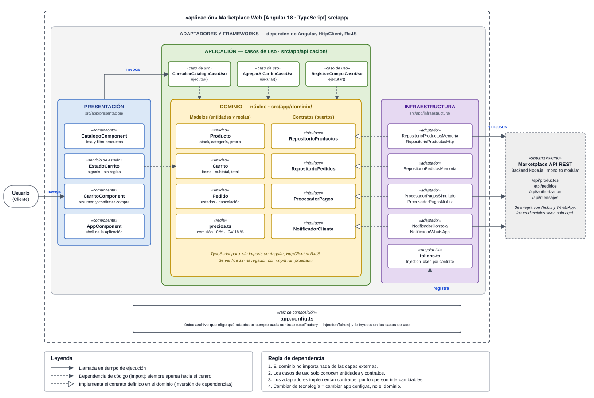

# Enfoque Arquitectónico: Clean Architecture

## 1. Descripción

| Elemento | Descripción aplicada al Marketplace |
|---|---|
| Patrón / enfoque arquitectónico | Clean Architecture (Arquitectura Limpia). |
| Objetivo | Separar responsabilidades y controlar las dependencias hacia el dominio. |
| ¿Qué problema resuelve? | Evita el acoplamiento entre la interfaz Angular, las reglas del negocio y las tecnologías externas, como bases de datos, API y servicios de pago. |
| Capas definidas | Presentación, Aplicación, Dominio e Infraestructura. |
| Beneficios | • Facilita el mantenimiento y las pruebas unitarias. • Permite cambiar implementaciones técnicas sin modificar innecesariamente las reglas del negocio. • Mejora la organización y separación de responsabilidades del código. |

## 2. Diagrama del enfoque

## 3. Regla de dependencia

1. El dominio no importa nada de las capas externas.
2. Los casos de uso solo conocen entidades y contratos.
3. Los adaptadores implementan contratos, por lo que son intercambiables.
4. Cambiar de tecnología = cambiar `app.config.ts`, no el dominio.

## 4. Capas y responsabilidades

| Capa | Ruta | Contenido | Ejemplo Marketplace |
|---|---|---|---|
| Dominio | `src/app/dominio/` | Entidades, reglas de negocio y contratos (puertos) | `Producto`, `Carrito`, `Pedido`, `precios.ts`, `RepositorioProductos` |
| Aplicación | `src/app/aplicacion/` | Casos de uso que orquestan el dominio | `ConsultarCatalogoCasoUso`, `AgregarAlCarritoCasoUso`, `RegistrarCompraCasoUso` |
| Presentación | `src/app/presentacion/` | Componentes y estado de la interfaz | `CatalogoComponent`, `CarritoComponent`, `EstadoCarrito`, `AppComponent` |
| Infraestructura | `src/app/infraestructura/` | Adaptadores que implementan los contratos | `RepositorioProductosHttp`, `ProcesadorPagosNiubiz`, `NotificadorWhatsApp`, `tokens.ts` |

## 5. Relación con las decisiones arquitectónicas

- **ADR-002 (Clean Architecture)** → responde a **DA06 - Mantenibilidad**.
- **ADR-004 (Pagos con interfaces y adaptadores)** → `ProcesadorPagos` (contrato en el dominio) + `ProcesadorPagosNiubiz` (adaptador en infraestructura), lo que responde a **DA04**.
