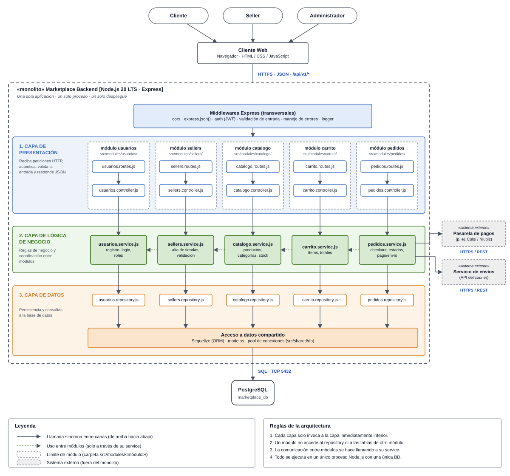

# Estilo Arquitectónico: Monolito Modular en Capas

## 1. Estilo seleccionado

**Monolito modular + arquitectura en capas** (cliente-servidor con API REST).

- **Monolito**: una sola aplicación, un solo proceso y un solo despliegue.
- **Modular**: el código se divide en módulos de negocio (usuarios, sellers, catálogo, carrito, pedidos).
- **Capas**: dentro de cada módulo se separan Presentación, Lógica de negocio y Datos.
- **Cliente-servidor**: el Cliente Web consume el backend mediante HTTPS · JSON (`/api/v1/*`).

## 2. Justificación (drivers)

| Driver | Cómo lo responde el estilo |
|---|---|
| DA01 - Escalabilidad | Monolito modular con posibilidad de escalamiento horizontal |
| DA05 - API REST | Frontend y backend separados por API REST |
| DA06 - Mantenibilidad | Módulos independientes: un cambio no afecta a los demás |
| DA04 - Pago externo | Integración con pasarela y courier mediante HTTPS / REST |

## 3. Diagrama de arquitectura

## 4. Capas y responsabilidades

| Capa | Responsabilidad | Componentes |
|---|---|---|
| 1. Presentación | Recibe peticiones HTTP, autentica, valida la entrada y responde JSON | `*.routes.js`, `*.controller.js` |
| 2. Lógica de negocio | Reglas de negocio y coordinación entre módulos | `*.service.js` |
| 3. Datos | Persistencia y consultas a la base de datos | `*.repository.js`, Sequelize, PostgreSQL |

## 5. Reglas de la arquitectura

1. Cada capa solo invoca a la capa inmediatamente inferior.
2. Un módulo no accede al *repository* ni a las tablas de otro módulo.
3. La comunicación entre módulos se hace llamando a su *service*.
4. Todo se ejecuta en un único proceso Node.js con una única base de datos.